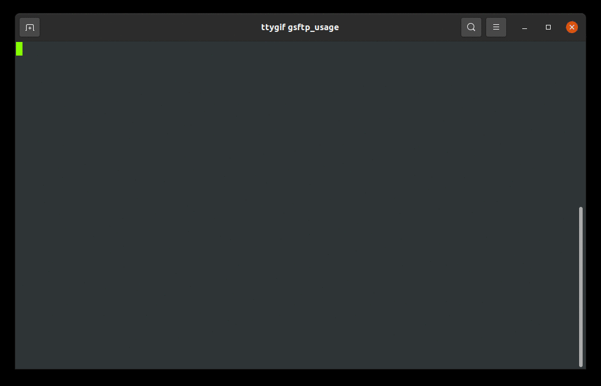

# gsftp
SFTP with a text-based graphical interface

Transfer files through an encrypted connection with a visual interface, so you can see both connections at once.

Use VIM keys or arrow keys for navigation!



## Controls

- `l` or `➡` (right arrow key): enter highlighted directory (move further down the directory tree)
- `h` or `⬅` (left arrow key): exit current directory (move further up the directory tree)
- `j` or `⬇` (down arrow key): move down
- `k` or `⬆` (up arrow key): move up
- `y` or `↩` (enter): download/upload highlighted item
- `w` or `↹` (tab): Switch windows
- `b` or `Ctrl`+`⬇`: navigate to bottom-most entry
- `g` or `Ctrl`+`⬆`: navigate to top-most entry
- `a`: toggle hidden files
- `q` or `Esc`: quit
- `?`: toggle help menu

## Installation
Note that you will need the development packages of OpenSSL installed.

___Ubuntu___
```bash
sudo apt install libssl-dev
```
___Fedora___
```bash
dnf install openssl-devel
```
You may also need the `pkg-config` utility to find OpenSSL (at least on Debian-based systems; I'm not sure about anything else):
```bash
sudo apt install pkg-config
```

### Cargo

Clone the repository (i.e. `git clone https://github.com/benharmonics/gsftp.git`), then
```bash
cargo install --path path/to/gsftp
```
Cargo will automatically install programs to `$HOME/.cargo` by default.
